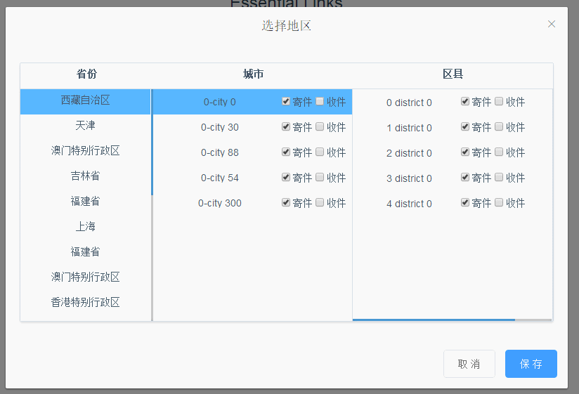
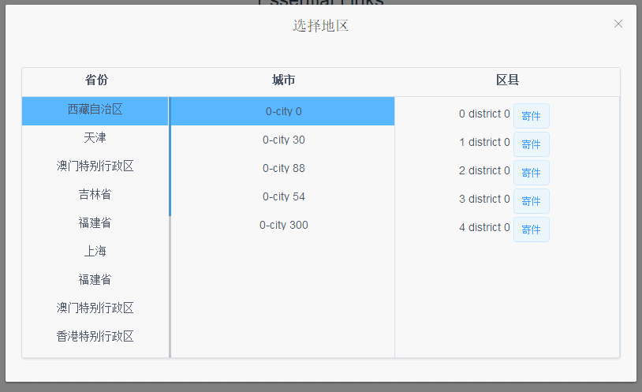

> A Vue.js
> 三级地址联动选择对话框


-  [json-server](https://github.com/typicode/json-server) 伪造后台接口服务
-  [mock.js](http://mockjs.com/) 伪造数据
-  [Element-ui](http://element.eleme.io/#/zh-CN/component/message-box) 样式渲染

**使用说明:**
  - 全局安装`json-server`插件   `npm i json-server -g`
  - `cd mock` 目录，启动服务  `json-server -w mock.js`
  - `cd ..` 在 最外层目录， `npm run dev` 启动


数据类型：
  **配置不同levels,生成不同级选择器，对应不用的数据结构，数组对象的嵌套层级相应会改变**
   - 一级选择器
     ```
       [
         { districtName:"北京",  // 省名
           checked:0          // 是否选中， 0 未选中， 1 选中
         },
         { districtName:"北京",
           checked:0
          },
         { districtName:"北京",
           checked:0
           }
      ]
     ```
   - 二级选择器
    ```
      [
        { districtName:"北京",      // 省名
          checked:0,               // 省对应的市是否全选: 0 否 ，非0 是
          city:[{                 //  省下面的市，对应对象数组。              
                 cityName:"北京市",
                 checked:0,
               },{
                  cityName:"北京市",
                  checked:0,
              }]
        }
     ]
    ```
   - 三级选择器
    ```
    [
      { districtName:"北京",      // 省名
        checked:0,               // 省对应的市是否全选: 0 否 ，非0 是
        city:[{                 //  省下面的市，对应对象数组。              
               cityName:"北京市",
               checked:0,

             },{
                cityName:"北京市",
                checked:0,
            }]
      }
   ]
    ```

  **check:  0，代表未选中   1，代表选中了寄件    2，代表选中收件    3，代表选中了寄件和收件**

  具体数据格式，见[/mock/list1.js](./mock/list1.js)
   配置不同levels,对应不用的数据结构


两种模式（可通过本地存储或后台接口进行关联）：

   编辑模式：
    


   查看模式：

   


组件：
`checkboxGroup.vue` 和对应的子组件`checkbox.vue`嵌套使用;
```
   <checkbox-group>
     <checkbox>
     </checkbox>
  </checkbox-group>
```

`checkbox.vue`组件，[主要由input 组成，](/src/components/checkbox.vue)
```
 <input v-module = "model" />
 <script>
   computed: {
      model:{
        set(val) {
          this.$parent.$emit('input',val)
        },
        get(){
          return this.store
        }
      }
   }

 </script>

```
子组件checkbox中 v-module 绑定的值发生变化时，触发父组件，即checkbox-group 中的input 事件，
同时 [v-module指令只是语法糖](https://cn.vuejs.org/v2/guide/components.html#使用自定义事件的表单输入组件) 相当于：
```
<input
 v-bind:value="something"
 v-on:input="something = $event.target.value">
```
所以，触发了父组件中的input 事件,相当于修改了父组件中的v-model 对应的的值。

## configCheckbox  --   attribute ##

参数   |   类型 |   说明 | 默认值
-----  |------ |-----  |  ----
visible|boolean|是否显示对话框|false
sourceData|Array|级联对话框中的数据源|
onlyRead | boolean| 是否以只读形式(查看形式)，显示级联对话框| true
levels    | Number| 级数|
tips      |Array|为三级选择框时，可设置不同选项（[可参看用例中的"寄，收"](./src/example/HelloWorld.vue)）待完善。|
